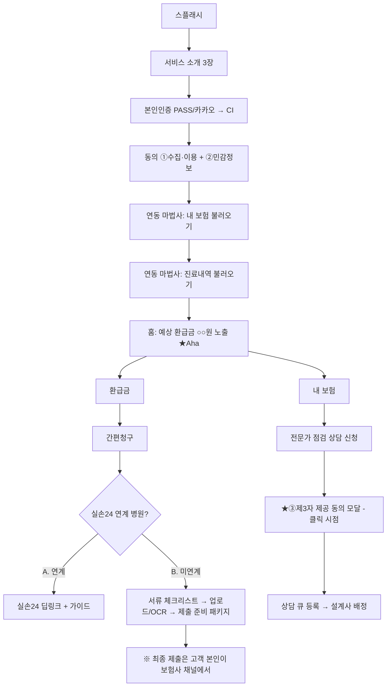

# 화면 와이어프레임 — 고객 앱 + 관리자 웹

표기: `[버튼]` `〈입력〉` `▸ 링크` `※ 고정 문구`. 모든 예측액 화면 하단에는 면책 문구가 강제 렌더링된다(공통 컴포넌트 `DisclaimerFooter`).

## 0. 전체 플로우



## 1. 온보딩 (5화면)

### 1-1. 스플래시 / 1-2. 소개 3장 (스와이프)
```
┌────────────────────────┐  1) "작년에 병원 다녀오고        2) "진료내역과 보험을      3) "청구는 가장 쉬운
│      내보험 찾기        │      못 받은 보험금,             연결하면 자동으로          길로 안내해 드려요.
│   놓친 보험금, 지금     │      얼마나 될까요?"             찾아드려요"                제출은 안전하게
│      찾아보세요         │                                                            직접, 공식 채널에서"
│   [시작하기]            │
└────────────────────────┘
```

### 1-3. 간편 회원가입
```
┌────────────────────────┐
│ 휴대폰 본인인증          │   · PASS / 카카오 선택
│ [PASS로 인증]           │   · 인증 완료 → CI 수신 → 계정 생성
│ [카카오로 인증]         │   · ★주민번호 입력 화면 없음
└────────────────────────┘
```

### 1-4. 동의 화면 (①+② 만)
```
┌────────────────────────┐
│ 서비스 이용 동의         │
│ ☑ [필수] 개인정보 수집·이용   ▸ 전문보기
│ ☑ [필수*] 민감정보(건강·진료) 처리 ▸ 전문보기
│    *데이터 연동 기능에만 필요. 미동의 시 연동 제한
│ ☐ [선택] 마케팅 정보 수신     ▸ 전문보기
│ [동의하고 계속]          │   · ③제3자 제공은 여기서 받지 않음(상담 신청 시점)
└────────────────────────┘
```

### 1-5. 데이터 연동 마법사 (2단계)
```
Step 1 내 보험 불러오기            Step 2 진료내역 불러오기
┌────────────────────────┐        ┌────────────────────────┐
│ 내보험찾아줌에서 가입    │        │ 건강보험공단에서 최근    │
│ 보험을 불러옵니다        │        │ 3년 진료내역을 불러옵니다│
│ [간편인증으로 불러오기]  │        │ [간편인증으로 불러오기]  │
│ ⏳ 스켈레톤 UI           │        │ ⏳ 예상 소요 약 1분      │
│ 실패 시 [재시도][건너뛰기]│        │ 실패 시 [재시도][건너뛰기]│
└────────────────────────┘        └────────────────────────┘
연동 완료 → 홈 진입. 첫 화면에서 즉시 "예상 환급금 ○○원".
```

## 2. 탭 1 — 홈

```
┌────────────────────────────────┐
│ 총 예상 환급금                  │  히어로 카드
│   ₩ 342,000                    │  = 숨은보험금(확정) + 미청구(예상)
│   [확정 120,000] [예상 222,000]│  구분 뱃지 필수
│ ※ 실제 지급액은 보험사 심사에    │
│   따라 달라질 수 있습니다        │
├────────────────────────────────┤
│ 진행 중 청구 (2)                │
│  삼성화재 · 통원 3건            │
│  ●──●──○──○                   │
│  서류준비 검토중 제출안내 지급확인│
├────────────────────────────────┤
│ 🔔 최근 알림 3건       ▸ 전체보기│
├────────────────────────────────┤
│ [새로 발견된 미청구 진료 4건 확인]│  CTA
└────────────────────────────────┘
· 당겨서 새로고침 / 주 1회 자동 재조회(동의 기반)
```

## 3. 탭 2 — 내 보험

```
┌────────────────────────────────┐
│ ⚠ 실손 중복 가입이 감지되었어요  │  조건부 경고 배너
├────────────────────────────────┤
│ 삼성화재 실손의료비보장보험      │
│  실손 3세대 · 자기부담 급여10%   │  세대 자동 태깅
│  월 32,000원 · ~2039.05        │
├────────────────────────────────┤
│ 한화생명 종신보험 ...           │
├────────────────────────────────┤
│ [내 보험, 전문가에게 점검받기]   │  → 클릭 시 ③제3자 제공 동의 모달
└────────────────────────────────┘

상품 상세: 주요 담보 요약 / 실손 세대·자기부담률 / 보장 시작·만기일
```

### 3-1. ③ 제3자 제공 동의 모달 (상담 신청 버튼 클릭 시점)
```
┌────────────────────────────────┐
│ 전문가 상담을 위해 아래 정보     │
│ 제공에 동의해 주세요             │
│  제공받는 자: 배정 설계사(제휴 GA)│
│  항목: 이름·연락처·보험 요약     │
│  보유기간: 상담 종료 후 3개월    │
│ ☐ 동의합니다 (선택 — 미동의 시   │
│    상담 신청만 제한)             │
│ [동의하고 상담 신청]  [취소]     │
└────────────────────────────────┘
```

## 4. 탭 3 — 환급금

```
┌────────────────────────────────┐
│ [숨은보험금] | [미청구 실비]     │  세그먼트 토글
├── 숨은보험금 뷰 ────────────────┤
│ 휴면보험금 · ○○생명            │
│  120,000원 (확정)               │
│  [찾으러 가기] → 내보험찾아줌/   │
│   보험사 채널 안내(딥링크/가이드)│
├── 미청구 실비 뷰 ───────────────┤
│ 서울정형외과 · 2025.11.02       │
│  본인부담금 48,000원            │
│  예상 환급액 33,000원  ▾산출근거 │
│   └ 3세대 통원(급여) 공제:       │
│     max(15,000, 48,000×10%)     │
│  소멸시효 D-712                 │
│  [청구 진행하기] → 탭4          │
│ ※ 실제 지급액은 보험사 심사에…   │
└────────────────────────────────┘
· 정렬: 예상액 높은 순 / 소멸시효 임박 순
· 산출 근거 없는 건: 금액 미표기, "검토 필요" 라벨만
```

## 5. 탭 4 — 간편청구 (라우팅 분기)

```
Step1 병원 선택            Step2 진료건 선택(다중)      Step3 자동 분기
┌──────────────┐          ┌──────────────┐
│ 서울정형외과 3건│          │ ☑ 11.02 통원 48,000│
│ 김안과 1건     │   →      │ ☑ 11.09 통원 31,000│  →  연계 여부 자동 판별
│ [+ 병원 수동 추가]│        │ ☐ 12.01 약제  8,000│
└──────────────┘          └──────────────┘

A. 실손24 연계 병원                  B. 미연계 병원
┌────────────────────────┐          ┌────────────────────────┐
│ ✅ 이 병원은 서류 없이   │          │ 필요서류 체크리스트(자동) │
│ 실손24로 바로 청구할 수  │          │ ☐ 진료비 영수증          │
│ 있어요                  │          │ ☐ 진료비 세부내역서       │
│ [실손24 앱 열기(딥링크)] │          │ ☐ 통원확인서(10만원 초과) │
│ 단계별 가이드 1→2→3     │          │ [📷 서류 촬영/업로드]     │
│ 청구 후 상태를 알려주세요 │          │  └ OCR: 금액·항목 자동인식│
│ [청구 완료로 표시]       │          │ [전문가 검토 요청(선택)]  │
└────────────────────────┘          │ [제출 준비 완료 패키지]   │
· 우리 시스템은 서류를 만지지 않음     │  └ 보험사 접수채널 안내 + │
· 상태만 사용자 입력으로 트래킹        │    작성완료 청구서 다운로드│
                                    │ ※ 제출 버튼은 보험사 채널 │
                                    │   에서 고객이 직접 누릅니다│
                                    └────────────────────────┘

Step4 전자서명(필요 시): 위임장·정보제공동의서 앱 내 서명 (효력 범위 법무 자문 반영)
Step5 진행상태: 서류준비 → 검토중 → 제출안내완료 → 지급확인
      지급 완료 시 실제 지급액 입력 → 예측 정확도 데이터 축적
```

## 6. 탭 5 — 마이

```
┌────────────────────────────────┐
│ 동의내역 관리                    │  4층 각각: 동의일시 + [철회]
│  └ 철회 시 영향 안내 모달        │
│ 위임장·청구서류 보관함           │  자동 파기 정책 표시
│ 상담 내역                        │  배정 담당자·상태
│ 가족 관리 (Phase 2)             │  구성원별 본인인증 필수
│ 회원 탈퇴(개인정보 삭제)         │  즉시 처리 + 파기 완료 알림
│ 고객센터 / 약관 / 처리방침       │
└────────────────────────────────┘
```

## 7. 관리자 웹 핵심 화면

역할(RBAC): 운영자 / 상담사 / 손해사정사 / 감사(read-only). 민감정보는 상담 신청 고객 건 + 배정 담당자만.

```
7-1 대시보드: 신규가입 · 연동성공률 · 발굴건수/금액 · 상담신청 · 청구전환율

7-2 상담 큐
┌──────────────────────────────────────────────┐
│ 신청목록 | 상태: 신청/배정/진행/완료           │
│ #1024 김○○ 보험점검 | [담당자 배정 ▾]         │
│  └ 리드 전달 시 ③동의 증적 자동 첨부(감사 로그) │
└──────────────────────────────────────────────┘

7-3 서류 검토 워크플로
업로드 서류 열람(뷰어만, 다운로드 금지) → 체크리스트 검수
→ [보완 요청](고객 앱 푸시) → [검토 완료]
· 손해사정사 검토 항목 별도 플래그

7-4 필요서류 매트릭스 관리: 보험사 × 청구유형(통원/입원/약제) × 금액구간 CRUD

7-5 담보 매칭 룰 관리: 세대별 자기부담·공제 파라미터 수정 UI (버전 이력)

7-6 감사 로그: 민감정보 열람 전건 (누가·언제·어떤 고객·어떤 데이터)
```
