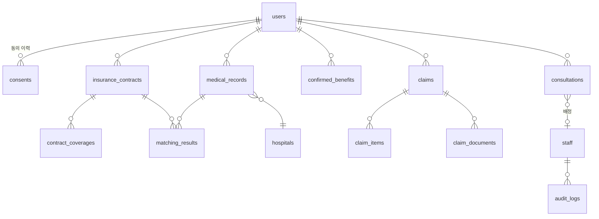

# DB 스키마 — PostgreSQL

설계 원칙:

- **주민등록번호 컬럼은 어디에도 존재하지 않는다.** 식별자는 본인인증 CI(암호화 저장).
- 민감정보(진료내역)는 별도 스키마 `medical`에 격리, DB 롤 분리(`app_core` 는 `medical` 스키마 접근 불가, `app_medical` 롤만 접근).
- 확정액(`confirmed_benefits`)과 예측액(`matching_results`)은 테이블 수준 분리 — 혼용 불가.
- `enc_` 접두 컬럼은 AES-256-GCM 필드 암호화(BYTEA), 키는 KMS 관리·DB 외부.
- 동의/감사 로그는 append-only (UPDATE/DELETE 권한 미부여).

## ERD 개요



## DDL

```sql
-- ========== core 스키마 ==========
CREATE SCHEMA IF NOT EXISTS core;
CREATE SCHEMA IF NOT EXISTS medical;   -- 민감정보 격리, 접근 롤 분리

-- 사용자: CI 기반. 주민번호 컬럼 없음(영구).
CREATE TABLE core.users (
    id              UUID PRIMARY KEY DEFAULT gen_random_uuid(),
    ci_hash         CHAR(64) NOT NULL UNIQUE,      -- SHA-256(CI) : 조회/중복확인용
    enc_ci          BYTEA    NOT NULL,             -- AES-256-GCM(CI) : 어댑터 호출용
    enc_name        BYTEA    NOT NULL,
    enc_phone       BYTEA    NOT NULL,
    birth_year      SMALLINT,                      -- 세대 판정 보조(원문 생년월일 미저장)
    status          TEXT NOT NULL DEFAULT 'ACTIVE' CHECK (status IN ('ACTIVE','WITHDRAWN')),
    withdrawn_at    TIMESTAMPTZ,
    created_at      TIMESTAMPTZ NOT NULL DEFAULT now()
);

-- 동의 이력: append-only 불변 로그. 철회도 새 행(action=WITHDRAW)으로 기록.
CREATE TABLE core.consents (
    id              BIGINT GENERATED ALWAYS AS IDENTITY PRIMARY KEY,
    user_id         UUID NOT NULL REFERENCES core.users(id),
    consent_type    TEXT NOT NULL CHECK (consent_type IN
                      ('PERSONAL_INFO','SENSITIVE_HEALTH','THIRD_PARTY','MARKETING')),
    action          TEXT NOT NULL CHECK (action IN ('GRANT','WITHDRAW')),
    document_version TEXT NOT NULL,                -- 동의서 문구 버전
    method          TEXT NOT NULL CHECK (method IN ('CHECKBOX','SIGNATURE')),
    context         TEXT,                          -- 예: 'CONSULT_REQUEST:1024' (③은 클릭 시점 증적)
    occurred_at     TIMESTAMPTZ NOT NULL DEFAULT now()
);
REVOKE UPDATE, DELETE ON core.consents FROM PUBLIC;

-- 보험계약 (내보험찾아줌 데이터)
CREATE TABLE core.insurance_contracts (
    id              UUID PRIMARY KEY DEFAULT gen_random_uuid(),
    user_id         UUID NOT NULL REFERENCES core.users(id),
    insurer_code    TEXT NOT NULL,                 -- 보험사 코드
    insurer_name    TEXT NOT NULL,
    product_name    TEXT NOT NULL,
    policy_no_hash  CHAR(64),                      -- 증권번호 해시(중복 방지)
    enc_policy_no   BYTEA,
    contract_type   TEXT NOT NULL CHECK (contract_type IN ('SILSON','OTHER')),
    silson_generation SMALLINT CHECK (silson_generation BETWEEN 1 AND 4),  -- 실손 세대 자동 태깅
    coverage_start  DATE,
    coverage_end    DATE,
    monthly_premium INTEGER,
    fetched_at      TIMESTAMPTZ NOT NULL,          -- 캐싱 정책(월 1회) 판단 기준
    created_at      TIMESTAMPTZ NOT NULL DEFAULT now()
);
CREATE INDEX ON core.insurance_contracts (user_id);

CREATE TABLE core.contract_coverages (             -- 담보
    id              UUID PRIMARY KEY DEFAULT gen_random_uuid(),
    contract_id     UUID NOT NULL REFERENCES core.insurance_contracts(id) ON DELETE CASCADE,
    coverage_name   TEXT NOT NULL,                 -- 예: 통원의료비(급여)
    claim_type      TEXT CHECK (claim_type IN ('OUTPATIENT','INPATIENT','PHARMACY')),
    benefit_category TEXT CHECK (benefit_category IN ('COVERED','UNCOVERED','BOTH')), -- 급여/비급여
    per_visit_limit INTEGER,                       -- 회당 한도
    annual_limit    BIGINT,
    deductible_fixed INTEGER,                      -- 정액 공제
    coinsurance_rate NUMERIC(5,4)                  -- 자기부담률 (0.1000 = 10%)
);

-- 병원 마스터: 실손24 연계 여부 = 라우팅 분기 키
CREATE TABLE core.hospitals (
    id              UUID PRIMARY KEY DEFAULT gen_random_uuid(),
    name            TEXT NOT NULL,
    ykiho_hash      CHAR(64) UNIQUE,               -- 요양기관기호 해시
    tier            TEXT NOT NULL DEFAULT 'CLINIC' CHECK (tier IN
                      ('CLINIC','HOSPITAL','GENERAL','TERTIARY','PHARMACY')),
    silson24_linked BOOLEAN NOT NULL DEFAULT false,
    silson24_checked_at TIMESTAMPTZ
);

-- 숨은보험금: 확정액. 예측 테이블과 절대 혼용 금지.
CREATE TABLE core.confirmed_benefits (
    id              UUID PRIMARY KEY DEFAULT gen_random_uuid(),
    user_id         UUID NOT NULL REFERENCES core.users(id),
    benefit_type    TEXT NOT NULL CHECK (benefit_type IN ('MATURED','SURRENDER','DORMANT','DIVIDEND','OTHER')),
    insurer_name    TEXT NOT NULL,
    amount          BIGINT NOT NULL,               -- 확정 금액(원)
    guide_channel   TEXT,                          -- 수령 안내 채널(딥링크/절차)
    fetched_at      TIMESTAMPTZ NOT NULL,
    claimed_at      TIMESTAMPTZ
);

-- ========== medical 스키마 (민감정보 · 롤 분리) ==========
CREATE TABLE medical.medical_records (
    id              UUID PRIMARY KEY DEFAULT gen_random_uuid(),
    user_id         UUID NOT NULL,                 -- FK는 논리적(스키마 분리 유지)
    hospital_id     UUID,
    enc_hospital_name BYTEA NOT NULL,
    hospital_tier   TEXT NOT NULL DEFAULT 'CLINIC' CHECK (hospital_tier IN
                      ('CLINIC','HOSPITAL','GENERAL','TERTIARY','PHARMACY')), -- 수신 시점 종별 스냅샷(공제 계산 입력)
    treatment_date  DATE NOT NULL,
    claim_type      TEXT NOT NULL CHECK (claim_type IN ('OUTPATIENT','INPATIENT','PHARMACY')),
    enc_detail      BYTEA,                         -- 상병·처방 등 상세(암호화 JSON)
    copay_covered   INTEGER NOT NULL DEFAULT 0,    -- 본인부담금(급여)
    copay_uncovered INTEGER NOT NULL DEFAULT 0,    -- 본인부담금(비급여)
    has_prescription BOOLEAN NOT NULL DEFAULT false,
    statute_expires_on DATE GENERATED ALWAYS AS ((treatment_date + INTERVAL '3 years')::date) STORED, -- 소멸시효
    source          TEXT NOT NULL DEFAULT 'CODEF', -- 어댑터 소스 추적
    fetched_at      TIMESTAMPTZ NOT NULL,
    purged_at       TIMESTAMPTZ                    -- 목적 달성 시 파기 마킹
);
CREATE INDEX ON medical.medical_records (user_id, treatment_date);

-- 매칭 결과: 예측액. disclaimer는 API 직렬화 단계에서 강제.
CREATE TABLE medical.matching_results (
    id              UUID PRIMARY KEY DEFAULT gen_random_uuid(),
    medical_record_id UUID NOT NULL REFERENCES medical.medical_records(id) ON DELETE CASCADE,
    contract_id     UUID NOT NULL,
    verdict         TEXT NOT NULL CHECK (verdict IN ('CLAIMABLE','NOT_CLAIMABLE','UNDETERMINED')),
    estimated_amount INTEGER,                      -- verdict=CLAIMABLE 일 때만. '예상' 접두는 표기 계층 책임
    formula         TEXT,                          -- 산출 근거 계산식 문자열(펼침 UI용)
    rule_version    TEXT NOT NULL,                 -- 파라미터 테이블 버전
    computed_at     TIMESTAMPTZ NOT NULL DEFAULT now(),
    CONSTRAINT amount_requires_formula CHECK (estimated_amount IS NULL OR formula IS NOT NULL)
);

-- ========== 청구 ==========
CREATE TABLE core.claims (
    id              UUID PRIMARY KEY DEFAULT gen_random_uuid(),
    user_id         UUID NOT NULL REFERENCES core.users(id),
    contract_id     UUID REFERENCES core.insurance_contracts(id),
    route           TEXT NOT NULL CHECK (route IN ('SILSON24','MANUAL')),  -- A/B 분기
    status          TEXT NOT NULL DEFAULT 'PREPARING' CHECK (status IN
                      ('PREPARING','IN_REVIEW','READY_TO_SUBMIT','SUBMITTED_BY_USER','PAID','CANCELLED')),
    -- ★SUBMITTED_BY_USER: 제출은 시스템이 아니라 항상 고객 본인 행위임을 상태명에 고정
    actual_paid_amount INTEGER,                    -- 지급 확인 시 사용자 입력 → 정확도 루프
    paid_confirmed_at TIMESTAMPTZ,
    created_at      TIMESTAMPTZ NOT NULL DEFAULT now(),
    updated_at      TIMESTAMPTZ NOT NULL DEFAULT now()
);

CREATE TABLE core.claim_items (                    -- 청구건 ↔ 진료건 (다중 선택)
    claim_id        UUID NOT NULL REFERENCES core.claims(id) ON DELETE CASCADE,
    medical_record_id UUID NOT NULL,
    matching_result_id UUID,
    PRIMARY KEY (claim_id, medical_record_id)
);

CREATE TABLE core.claim_documents (
    id              UUID PRIMARY KEY DEFAULT gen_random_uuid(),
    claim_id        UUID NOT NULL REFERENCES core.claims(id) ON DELETE CASCADE,
    doc_type        TEXT NOT NULL,                 -- 필요서류 매트릭스 코드
    storage_key     TEXT,                          -- 오브젝트 스토리지(SSE-KMS)
    ocr_result      JSONB,                         -- 영수증 금액·항목 자동 인식
    review_status   TEXT NOT NULL DEFAULT 'UPLOADED' CHECK (review_status IN
                      ('REQUIRED','UPLOADED','NEEDS_FIX','REVIEWED')),
    adjuster_flag   BOOLEAN NOT NULL DEFAULT false, -- 손해사정사 검토 항목 플래그
    signed_at       TIMESTAMPTZ,                   -- 전자서명 서류
    auto_purge_on   DATE,                          -- 보관함 자동 파기 정책
    uploaded_at     TIMESTAMPTZ
);

-- 필요서류 매트릭스: 보험사 × 청구유형 × 금액구간
CREATE TABLE core.document_matrix (
    id              UUID PRIMARY KEY DEFAULT gen_random_uuid(),
    insurer_code    TEXT NOT NULL,
    claim_type      TEXT NOT NULL CHECK (claim_type IN ('OUTPATIENT','INPATIENT','PHARMACY')),
    amount_min      INTEGER NOT NULL DEFAULT 0,
    amount_max      INTEGER,                       -- NULL = 무제한
    required_docs   JSONB NOT NULL,                -- [{code,name,required,note}]
    channel_guide   JSONB NOT NULL,                -- {app,fax,email} 접수 채널 안내
    version         INTEGER NOT NULL DEFAULT 1,
    updated_by      UUID,
    updated_at      TIMESTAMPTZ NOT NULL DEFAULT now(),
    UNIQUE (insurer_code, claim_type, amount_min)
);

-- 담보 매칭 파라미터(세대별 공제 규칙) — 관리자 수정 가능, 버전 이력
CREATE TABLE core.matching_parameters (
    id              UUID PRIMARY KEY DEFAULT gen_random_uuid(),
    generation      SMALLINT NOT NULL CHECK (generation BETWEEN 1 AND 4),
    claim_type      TEXT NOT NULL,
    benefit_category TEXT NOT NULL,                -- COVERED/UNCOVERED
    deductible_by_tier JSONB NOT NULL,             -- {CLINIC:10000, HOSPITAL:15000, ...}
    coinsurance_rate NUMERIC(5,4) NOT NULL,
    per_visit_limit INTEGER,
    version         TEXT NOT NULL,
    active          BOOLEAN NOT NULL DEFAULT true,
    updated_at      TIMESTAMPTZ NOT NULL DEFAULT now()
);

-- ========== 상담(리드) · 운영 ==========
CREATE TABLE core.staff (
    id              UUID PRIMARY KEY DEFAULT gen_random_uuid(),
    role            TEXT NOT NULL CHECK (role IN ('OPERATOR','CONSULTANT','ADJUSTER','AUDITOR')),
    name            TEXT NOT NULL,
    email           TEXT NOT NULL UNIQUE,
    active          BOOLEAN NOT NULL DEFAULT true
);

CREATE TABLE core.consultations (
    id              UUID PRIMARY KEY DEFAULT gen_random_uuid(),
    user_id         UUID NOT NULL REFERENCES core.users(id),
    kind            TEXT NOT NULL CHECK (kind IN ('POLICY_REVIEW','ADJUSTER_REVIEW')),  -- 전환점1/2
    status          TEXT NOT NULL DEFAULT 'REQUESTED' CHECK (status IN
                      ('REQUESTED','ASSIGNED','IN_PROGRESS','COMPLETED','CANCELLED')),
    assigned_staff_id UUID REFERENCES core.staff(id),
    third_party_consent_id BIGINT NOT NULL,        -- ★③동의 증적 필수 첨부 (consents.id)
    lead_outcome    TEXT,                          -- 리드 전환 추적
    requested_at    TIMESTAMPTZ NOT NULL DEFAULT now()
);

-- 감사 로그: 민감정보 열람 전건, append-only
CREATE TABLE core.audit_logs (
    id              BIGINT GENERATED ALWAYS AS IDENTITY PRIMARY KEY,
    staff_id        UUID REFERENCES core.staff(id),
    action          TEXT NOT NULL,                 -- VIEW_MEDICAL / VIEW_DOCUMENT / ...
    target_user_id  UUID NOT NULL,
    target_resource TEXT NOT NULL,                 -- 테이블/리소스 식별
    occurred_at     TIMESTAMPTZ NOT NULL DEFAULT now()
);
REVOKE UPDATE, DELETE ON core.audit_logs FROM PUBLIC;

-- 연동 잡(비동기): 간편인증 → 콜백 → 수신
CREATE TABLE core.sync_jobs (
    id              UUID PRIMARY KEY DEFAULT gen_random_uuid(),
    user_id         UUID NOT NULL REFERENCES core.users(id),
    provider        TEXT NOT NULL,                 -- CODEF / MYHEALTHWAY / PARTNER
    kind            TEXT NOT NULL CHECK (kind IN ('MEDICAL','CONTRACT')),
    status          TEXT NOT NULL DEFAULT 'PENDING' CHECK (status IN
                      ('PENDING','WAITING_AUTH','FETCHING','DONE','FAILED')),
    error_code      TEXT,
    started_at      TIMESTAMPTZ NOT NULL DEFAULT now(),
    finished_at     TIMESTAMPTZ
);

CREATE TABLE core.notifications (
    id              UUID PRIMARY KEY DEFAULT gen_random_uuid(),
    user_id         UUID NOT NULL REFERENCES core.users(id),
    trigger         TEXT NOT NULL CHECK (trigger IN
                      ('NEW_UNCLAIMED','STATUTE_D90','STATUTE_D30','DOC_FIX_REQUEST','REVIEW_DONE','CONSULT_ASSIGNED')),
    channel         TEXT NOT NULL CHECK (channel IN ('PUSH','ALIMTALK')),
    payload         JSONB NOT NULL,
    sent_at         TIMESTAMPTZ,
    read_at         TIMESTAMPTZ,
    created_at      TIMESTAMPTZ NOT NULL DEFAULT now()
);
```

## 보존·파기 정책 매핑

| 데이터 | 파기 시점 | 구현 |
|---|---|---|
| 진료내역 원본 | 목적 달성(청구 완료/사용자 삭제) | `purged_at` 마킹 후 배치 물리 삭제, 통계는 비식별 집계로 이관 |
| 업로드 서류 | 보관함 정책 기간 경과 | `auto_purge_on` 배치 |
| 탈퇴 회원 | 즉시 (법정 보존분 분리 보관) | `status=WITHDRAWN` → 파기 배치 + 보존 테이블 분리 |
| 동의/감사 로그 | 법정 기간 | append-only 유지 |
